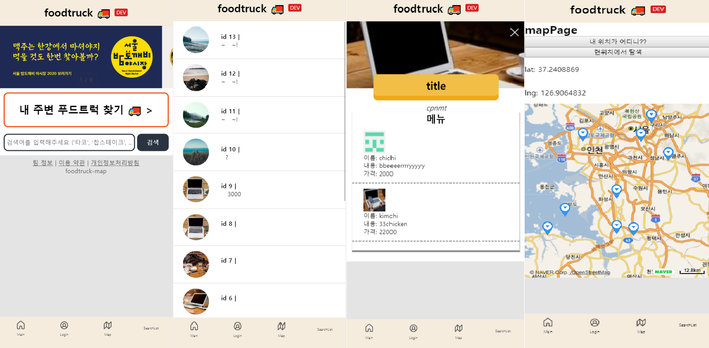

 
### &nbsp;&nbsp;&nbsp;&nbsp;&nbsp;&nbsp;&nbsp;&nbsp;&nbsp;&nbsp;&nbsp;&nbsp;&nbsp;&nbsp;&nbsp;&nbsp;&nbsp;&nbsp;&nbsp;&nbsp;&nbsp;&nbsp;&nbsp;&nbsp;&nbsp;&nbsp;&nbsp;&nbsp;&nbsp;&nbsp;&nbsp;&nbsp;&nbsp;&nbsp;&nbsp;&nbsp;&nbsp;&nbsp;&nbsp;&nbsp;&nbsp;&nbsp;&nbsp;&nbsp;&nbsp;&nbsp;&nbsp;&nbsp;&nbsp;&nbsp;&nbsp;&nbsp;&nbsp;&nbsp;&nbsp;&nbsp;&nbsp;&nbsp;&nbsp;&nbsp;&nbsp;&nbsp;&nbsp;&nbsp;&nbsp;&nbsp;&nbsp;&nbsp;&nbsp;&nbsp;&nbsp;&nbsp;&nbsp;&nbsp;&nbsp;&nbsp;&nbsp;&nbsp;&nbsp;&nbsp;&nbsp;&nbsp;&nbsp;&nbsp;&nbsp;&nbsp;&nbsp;&nbsp;&nbsp;&nbsp;&nbsp; FOODTRUCK MAP(가제)
  

---

# ✨ 프로젝트 목표

    대학교를 다니던 시절 저는 월요일 저녁이 오기만을 항상 기다렸습니다.  파란색 포터 트럭을 이끌며 늘 양털 모자를 쓰시고 오셨던 그 아저씨는, 트럭에 한아름의 돼지고기 바비큐와 전기구이 통닭을 싣고, 같은 시간 그렇게 늘 잊지 않고 찾아 오셨습니다. 단 돈 만원이면 저는 행복한 저녁을 보낼 수 있었고, 지금은 타지로 멀리 떠나온 저는 요즘도 월요일 저녁만 되면 그 때가 떠오릅니다.

    때로는 떠들썩한 학교 축제에서, 때로는 집으로 돌아가는 길에서, 또 때로는 포장마차와 같은 모습으로, *푸드트럭은 어느 곳에나 있습니다.* 우리의 마음 속 어느 곳에도 이러한 푸드트럭의 추억 하나쯤 다 있는 게 아닐는지 저는 생각합니다. 그러한 추억들을 쉽게 찾고 공유하기 위해 프로젝트를 시작하였습니다.

- 🚚푸드트럭 사장님 입장에서🚚
    - 매장의 open/close 관리를 손쉽게 해드립니다.
    - 매장의 리뷰, 사용자 팔로잉 등을 통해 손님 관리를 가능하게 합니다.

- 💰푸드트럭 탐험가 입장에서💰
    - 내 주변에 있는 푸드트럭을 알려드립니다.
    - 푸드트럭에 대한 메뉴 정보를 얻을 수 있습니다.
    - 푸드트럭에 대한 리뷰를 보고 참고할 수 있으며, 리뷰 또한 남길 수 있습니다.
    - 관심있는 푸드트럭을 팔로우하여 정보를 받아볼 수 있습니다.

---

# 👦팀 역할

- 김건호(팀장, 서기)
- 이호준(팀원, 백엔드 담당)
- 장현진(팀원, 프론트엔드 담당)
- 한다혜(팀원, 백엔드 담당)
- 황준오(프로젝트 매니져)

---

# 🔨 How to Build?

    git clone https://lab.ssafy.com/ghleokim/foodtruck-map.git

- 백엔드 빌드 방법

    1. $ cd foodtruck-map/backend/
    2. $ npm install
    3. $ npm start

- 프론트엔드 빌드 방법

    1. $ cd foodtruck-map
    2. $ yarn
    3. $ cd foodtruck-map/frontend/packages/common
    4. $ yarn build
    5. $ cd ../web
    6. $ yarn start

---

# 💻 개발 환경

- MySQL v8.0.19
- Node.js v12.14.1
- npm v6.13.4
- express v4.16.1
- React-Native
- React-Native-Web
- Visual Studio Code
- Atom

---

# 📑 개발 언어

- Back-End: node.js + MySQL
- Front-End: React-Native

---

# 📁 사용 라이브러리

- Express.js
- Sequelize
- Naver map API